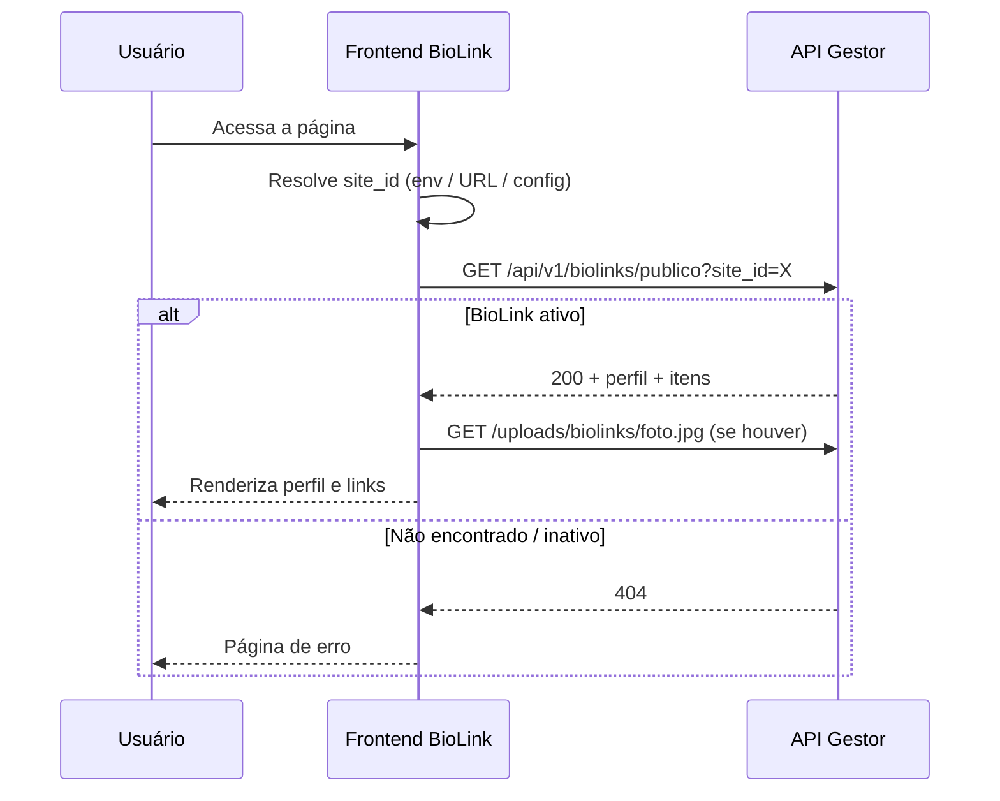

# BioLink — API pública (consulta de perfil e itens)

Documento para o **frontend da página pública de BioLink** consumir dados do backend Gestor sem autenticação.

---

## Resumo

| Item | Valor |
|------|-------|
| Método | `GET` |
| Endpoint | `/api/v1/biolinks/publico` |
| Autenticação | **Não requer** (rota pública) |
| Formato | JSON em **snake_case** |
| Identificador | Query param `site_id` (ID numérico do site no banco) |

Uma única requisição retorna o **perfil do usuário** (nome, descrição, foto) e a **lista de links ativos**, já ordenados.

---

## URL base

Em desenvolvimento:

```
http://localhost:8080
```

Em produção, use a URL do servidor da API (ex.: `https://api.convertix.net.br`).

Exemplo completo:

```
GET https://api.convertix.net.br/api/v1/biolinks/publico?site_id=4
```

---

## Parâmetros

| Parâmetro | Tipo | Obrigatório | Descrição |
|-----------|------|-------------|-----------|
| `site_id` | `number` | Sim | ID do site cadastrado no Gestor (tipo `BIOLINK`) |

---

## Regras de visibilidade

O backend só retorna dados quando **todas** as condições abaixo são verdadeiras:

1. Existe um site com o `site_id` informado
2. O site é do tipo `BIOLINK`
3. O site está com status `ATIVO`
4. Existe um BioLink vinculado ao site

Caso contrário, a resposta é **404 Not Found** com a mensagem `"BioLink não encontrado"`.

> Sites com status `INATIVO` ou `EM_DESENVOLVIMENTO` **não** aparecem na rota pública.

---

## Itens (links)

Na resposta pública, entram **somente itens com `ativo = true`**, ordenados pelo campo `ordem` (menor primeiro).

Itens inativos ou ainda não cadastrados no painel **não** são retornados.

Para o mapeamento visual dos ícones, consulte [BIOLINK_ITEM_ICONE.md](./BIOLINK_ITEM_ICONE.md).

---

## Response — sucesso (200)

### Estrutura

```json
{
  "site_id": 4,
  "nome_usuario": "Convertix",
  "descricao": "Soluções digitais para o seu negócio",
  "foto_perfil": "/uploads/biolinks/a1b2c3d4-e5f6-7890-abcd-ef1234567890.jpg",
  "itens": [
    {
      "titulo": "WhatsApp",
      "url": "https://wa.me/5541999999999",
      "icone": "WHATSAPP",
      "ordem": 0
    },
    {
      "titulo": "Instagram",
      "url": "https://instagram.com/convertix",
      "icone": "INSTAGRAM",
      "ordem": 1
    },
    {
      "titulo": "Site",
      "url": "https://convertix.net.br",
      "icone": "OUTROS",
      "ordem": 2
    }
  ]
}
```

### Campos do perfil

| Campo | Tipo | Nullable | Descrição |
|-------|------|----------|-----------|
| `site_id` | `number` | Não | ID do site (mesmo valor enviado na query) |
| `nome_usuario` | `string` | Não | Nome exibido no topo da página |
| `descricao` | `string` | Sim | Texto de bio abaixo do nome |
| `foto_perfil` | `string` | Sim | Caminho relativo da foto de perfil |
| `itens` | `array` | Não | Lista de links (pode ser vazia `[]`) |

### Campos de cada item

| Campo | Tipo | Nullable | Descrição |
|-------|------|----------|-----------|
| `titulo` | `string` | Não | Texto do botão/link |
| `url` | `string` | Não | URL de destino (abrir em nova aba) |
| `icone` | `string` (enum) | Sim | Plataforma para ícone visual — ver [BIOLINK_ITEM_ICONE.md](./BIOLINK_ITEM_ICONE.md) |
| `ordem` | `number` | Não | Posição na lista (0 = primeiro) |

---

## Foto de perfil

O campo `foto_perfil` vem como **caminho relativo**, não como URL absoluta.

| Valor retornado | Como exibir |
|-----------------|-------------|
| `null` | Mostrar avatar placeholder / iniciais |
| `"/uploads/biolinks/arquivo.jpg"` | Concatenar com a URL base da API |

Exemplo:

```
foto_perfil: "/uploads/biolinks/abc.jpg"
URL base:    "https://api.convertix.net.br"
Resultado:   "https://api.convertix.net.br/uploads/biolinks/abc.jpg"
```

A rota `/uploads/**` também é **pública** (GET sem token).

Formatos aceitos no upload: JPEG, PNG, WebP.

---

## Response — erro (404)

Quando o BioLink não existe ou não está publicado:

```json
{
  "timestamp": "2026-07-01T14:30:00",
  "status": 404,
  "error": "Not Found",
  "message": "BioLink não encontrado"
}
```

Trate esse cenário na UI com página de “não encontrado” ou mensagem amigável.

---

## Exemplos de consumo

### cURL

```bash
curl -X GET "http://localhost:8080/api/v1/biolinks/publico?site_id=4"
```

### JavaScript (fetch)

```javascript
const API_BASE = "https://api.convertix.net.br";
const SITE_ID = 4;

async function carregarBioLink() {
  const response = await fetch(
    `${API_BASE}/api/v1/biolinks/publico?site_id=${SITE_ID}`
  );

  if (!response.ok) {
    if (response.status === 404) {
      throw new Error("BioLink não encontrado");
    }
    throw new Error("Erro ao carregar BioLink");
  }

  const data = await response.json();

  const fotoUrl = data.foto_perfil
    ? `${API_BASE}${data.foto_perfil}`
    : null;

  return { ...data, fotoUrl };
}
```

### TypeScript — tipos sugeridos

```typescript
type BioLinkItemIcone =
  | "WHATSAPP" | "INSTAGRAM" | "TIKTOK" | "YOUTUBE" | "FACEBOOK"
  | "LINKEDIN" | "X" | "TELEGRAM" | "DISCORD" | "SPOTIFY"
  | "PINTEREST" | "THREADS" | "SNAPCHAT" | "TWITCH" | "GITHUB"
  | "BEHANCE" | "DRIBBBLE" | "MEDIUM" | "SUBSTACK" | "GOOGLE_MAPS"
  | "OUTROS";

interface BioLinkItemPublico {
  titulo: string;
  url: string;
  icone: BioLinkItemIcone | null;
  ordem: number;
}

interface BioLinkPublicoResponse {
  site_id: number;
  nome_usuario: string;
  descricao: string | null;
  foto_perfil: string | null;
  itens: BioLinkItemPublico[];
}
```

---

## CORS

A API aceita requisições de qualquer origem (`AllowedOriginPatterns: *`) para métodos GET, POST, PUT, DELETE, PATCH e OPTIONS.

O frontend pode chamar a rota pública diretamente do browser sem proxy, desde que use a URL correta da API.

---

## Como obter o `site_id`

A rota pública exige o **`site_id` numérico**, não o subdomínio nem o slug.

Opções comuns no frontend:

| Estratégia | Exemplo |
|------------|---------|
| Variável de ambiente por deploy | Cada subdomínio (`joao.convertix.link`) aponta para um build com `SITE_ID=4` |
| Parâmetro na URL | `https://link.convertix.net.br/4` → front extrai `4` e chama a API |
| Config estática | Mapa `{ "joao": 4, "maria": 7 }` no front ou em CDN |

> Hoje o backend **não** expõe busca pública por subdomínio. Se precisar disso no futuro, será uma nova rota.

---

## Fluxo recomendado na página pública



---

## Checklist para o frontend

- [ ] Definir de onde vem o `site_id` em cada deploy/página
- [ ] Chamar `GET /api/v1/biolinks/publico?site_id={id}` na carga da página
- [ ] Montar URL absoluta da foto com a base da API
- [ ] Renderizar `itens` na ordem recebida (já vem ordenado por `ordem`)
- [ ] Mapear `icone` para SVG/ícone visual (ver [BIOLINK_ITEM_ICONE.md](./BIOLINK_ITEM_ICONE.md))
- [ ] Tratar `icone: null` com ícone genérico
- [ ] Abrir `url` dos itens em nova aba (`target="_blank"`, `rel="noopener noreferrer"`)
- [ ] Tratar 404 com UI de “página não encontrada”
- [ ] Não enviar header `Authorization` — rota é pública

---

## O que **não** vem na rota pública

Por segurança e simplicidade, estes dados **não** são expostos:

| Campo | Motivo |
|-------|--------|
| `biolink_id` | Identificador interno |
| `cliente_id` | Dado administrativo |
| `ativo` dos itens | Apenas itens ativos são retornados |
| `created_at` / `updated_at` | Metadados internos |
| Status do site | Já filtrado no backend |

Para gestão (criar, editar, excluir), use as rotas autenticadas em `/api/v1/biolinks` e `/api/v1/biolinks/itens`.

---

*Backend Gestor — julho/2026.*
